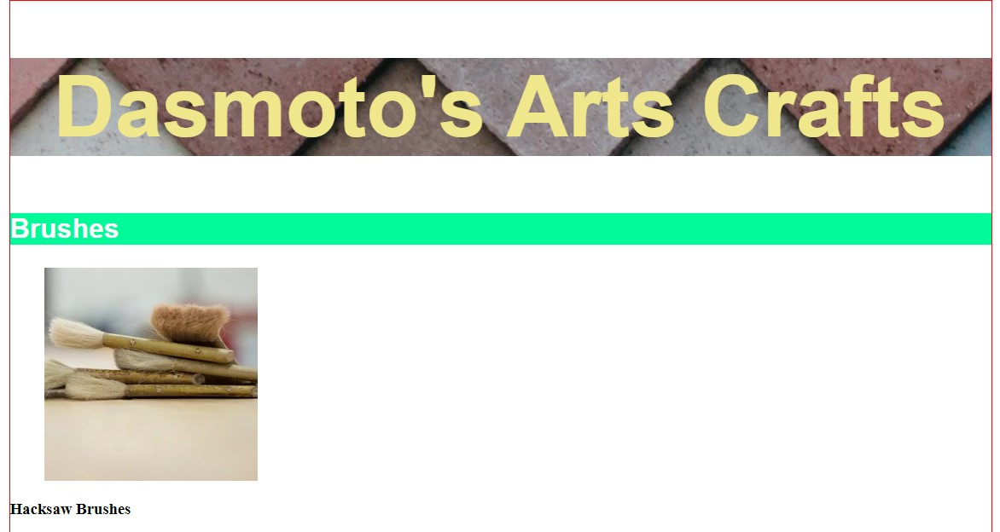
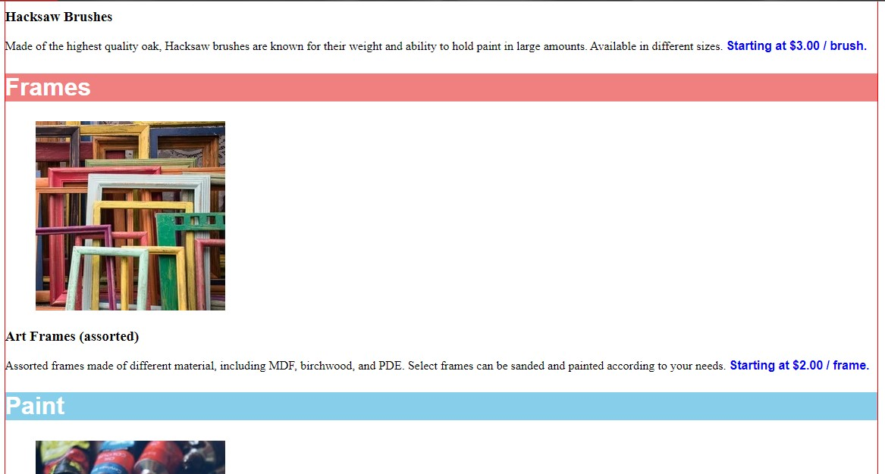
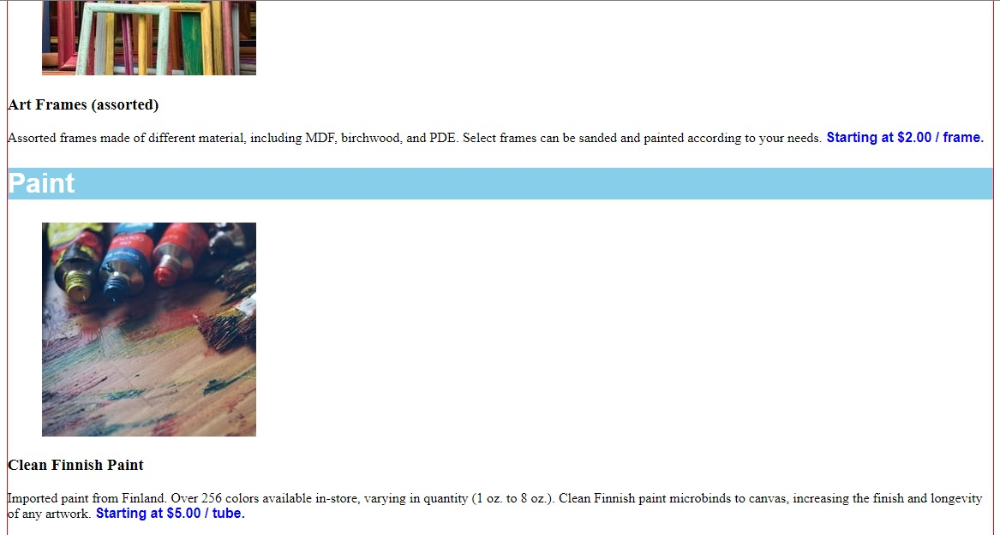

# Dasmoto-s-Arts---Crafts

> Codecademy's Web Developement Fundamentals off-platform project

## Table of Contents

* [Technologies Used](#technologies-used)
* [Screenshots](#screenshots)
* [Project Status](#project-status)
* [Acknowledgements](#acknowledgements)
* [Contact](#contact)

## Technologies Used

- HTML
- CSS

## Screenshots

 

 

 

## Project Status

Project is: complete
It was a course project and I have no plans for further developements.

## Acknowledgements

- This project was based on [this tutorial](https://www.codecademy.com/paths/full-stack-engineer-career-path/tracks/fscp-web-development-fundamentals/modules/fecp-developing-with-css/projects/dasmoto).

## Contact

Created by [@hiradfazeli](https://hiradfazeli.github.io/) - feel free to contact me!
